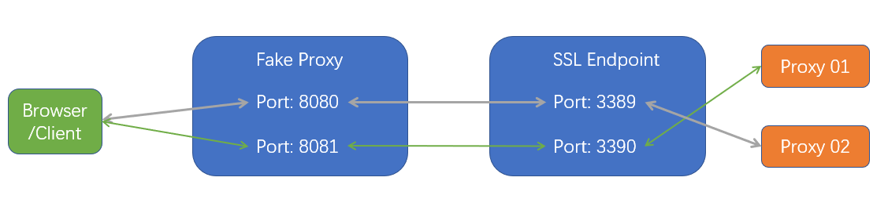

# Proxy Tunnel

### 建立TCP流量加密转发通道从而可以更安全的使用Proxy

Fake Proxy 与 Ssl Endpoint 之间使用SSL的双向认证, 可同时支持多条链路

* Browser

   想要使用Real Proxy的客户端

* Fake Proxy: 假代理
  
   这个代理只是接收browser(其它使用代理的客户端)的TCP流量，并将流量加密转发给ssl endpoint或者将ssl endpoint的加密流量解密传递给browser
   
   Browser 与 Fake Proxy之间依赖于可信的内部网络
   
* Ssl Endpoint
   
   流量转发中继，其负责接收fake proxy的加密流量解密后传送给最终Real Proxy 或者将real proxy的流量加密后传送给Fake proxy

* Real Proxy

   最终要使用的Proxy

## 使用说明
### Fake Proxy 与 Ssl Endpoint证书
Fake Proxy 与 Ssl EndPoint 之间需要进行证书的双向认证，因此需要分别为其生成证书以及密钥文件；

建议使用自签发的CA证书，分别生成Fake Proxy 与 Ssl Endpoint的证书与密钥

> certs文件夹里已经生成了一套自签发证书 偷懒可以直接使用

### 配置

|配置项|是否必须|默认值|说明|
|:---:|:----:|:---:|:---:|
|mappingFile|false|mapping.txt|fake proxy 与 sslendpoint 或者 sslendpoint与real proxy映射关系表|
|maxConnectionBacklog|false|1000|fake server 和 ssl endpoint的tcp backlog|
|workerEventGroupNumber|false|cpu逻辑核数|io worker thread number|
|idleTimeoutForClient|false|60000|idle timeout when no io, ms|
|connectionTimeoutToProxyServer|false|10000|fake proxy 与 ssl endpoint连接超时时间|
|openNettyLoggingHandler|false|0|是否开启netty LoggingHandler, 1打开|
|openTcpFastOpen|false|0|是否开启tcp fast open, 1打开; 需要内核参数支持|
|tcpFastOpenBacklog|false|256|tcp fast open syn-recv队列大小|
|openTcpFastOpenConnect|false|0|是否开启client tcp fast open, 1打开; 需要内核参数支持|
|sslProtocol|false|TLSv1.2|tls 协议版本 TLSv1.3 TLSv1.2|
|keyCertChainFile|必须|-|fake proxy或者 ssl endpoint的证书|
|keyFile|必须|-|fake proxy或者 ssl endpoint的证书密钥|
|keyPassword|否|-|密钥密码|
|trustCertFile|必须|-|签发证书的根证书CA|

### mapping.txt 文件
该文件指明fake proxy 与 ssl endpoint 或者 ssl endpoint 与 real proxy的对应关系

文件格式:
* 每行一个映射关系 localaddress:localport,remoteaddress:remoteport
* 以#开头的行作为注释

### 启动

* Fake Proxy: 127.0.0.1:8080 127.0.0.1:8081
* Ssl Endpoint: sslendpoint.com:3389 sslendpoint.com:3390
* Real Proxy: http proxy （realproxy.com:3128, realproxy.com:3129） 账号密码 user:password

#### Browser
在Browser中配置代理地址为 127.0.0.1:8080 账号密码: user:password

#### Fake Proxy
修改mapping.txt文件
~~~shell script
0.0.0.0:8080,sslendpoint.com:3389
0.0.0.0:8081,sslendpoint.com:3390
~~~

修改run_fakeserver.sh

~~~shell script
-DmappingFile=mapping.txt
-DkeyCertChainFile=certs/users/client.crt -DkeyFile=certs/users/client.pk8 -DkeyPassword=123456 
-DtrustCertFile=certs/ca/ca.crt
~~~

~~~shell script
sh run_fakeserver.sh &
~~~

### Ssl EndPoint
修改mapping.txt
~~~shell script
0.0.0.0:3389,realproxy.com:3128
0.0.0.0:3390,realproxy.com:3129
~~~

修改 run_sslendpoint.sh

~~~shell script
-DmappingFile=mapping.txt
-DkeyCertChainFile=certs/server/server.crt -DkeyFile=certs/server/server.pk8 -DkeyPassword=123456
-DtrustCertFile=certs/ca/ca.crt"
~~~

~~~shell script
sh run_sslendpoint.sh
~~~

### Docker 模式
拉取镜像

~~~shell script
docker pull blueoom/proxytunnel
~~~

> 通 -e 传递环境变量来设置可配置项 通过-v来映射mapping.txt文件

启动fake server

~~~shell script
docker run -dti -e DOCKER_MODE=1 \
  --network host \
  --privileged \
  -e mappingFile=mapping.txt \
  -e keyCertChainFile=certs/users/client.crt \
  -e keyFile=certs/users/client.pk8 \
  -e keyPassword=123456 \
  -e trustCertFile=certs/ca/ca.crt \
  -v /home/proxytunnel/mapping.txt:/home/proxytunnel/mapping.txt \
  blueoom/proxytunnel fakeserver
~~~

启动ssl endpoint

~~~shell script
docker run -dti -e DOCKER_MODE=1 \
  --network host \
  --privileged \
  -e mappingFile=mapping.txt \
  -e keyCertChainFile=certs/server/server.crt \
  -e keyFile=certs/server/server.pk8 \
  -e keyPassword=123456 \
  -e trustCertFile=certs/ca/ca.crt \
  -v /home/proxytunnel/mapping.txt:/home/proxytunnel/mapping.txt \
  blueoom/proxytunnel sslendpoint
~~~

**直接在docker主机部署建议使用docker-compose**

### 没有做的
* fake proxy 与 ssl endpoint之间的流量可以加以混淆, 可自己动手实现encoder/decoder

### 声明
本项目旨在实现数据流量的安全传输, 如要本项目发挥**其它功能**请自行探索